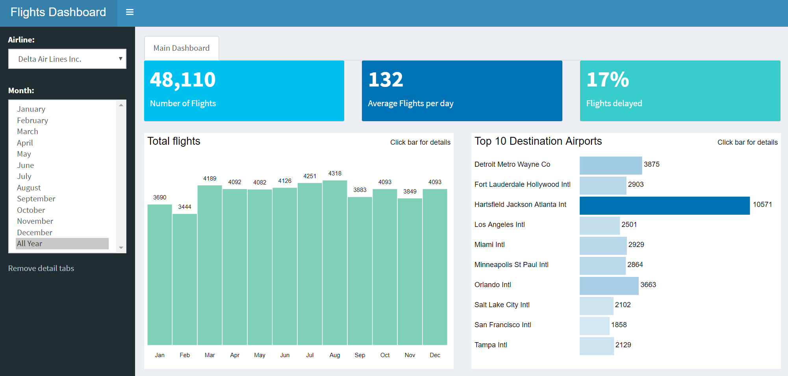

# Enterprise-ready dashboards

A live version of this app can be found [here](https://edgarruiz.shinyapps.io/db-dashboard/). Read more about enterprise dashboards with R at [db.rstudio.com](https://db.rstudio.com/best-practices/dashboards/). 

### Design principles

* Push as much of the calculations of the dashboard back to the database
* Give the end-user with “train of thought” paths
* Make data driven inputs
* Secure the database credentials

